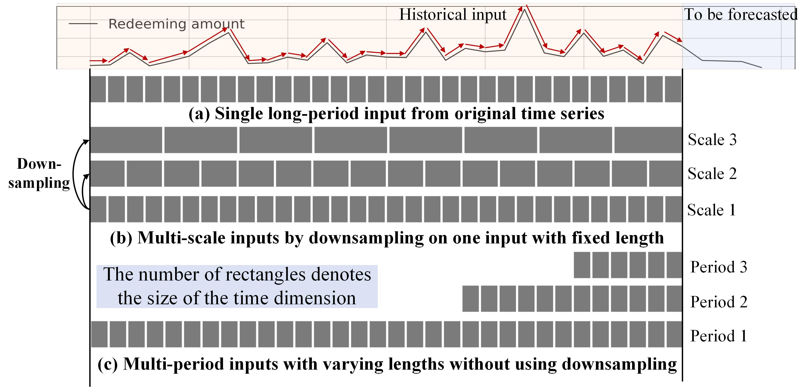
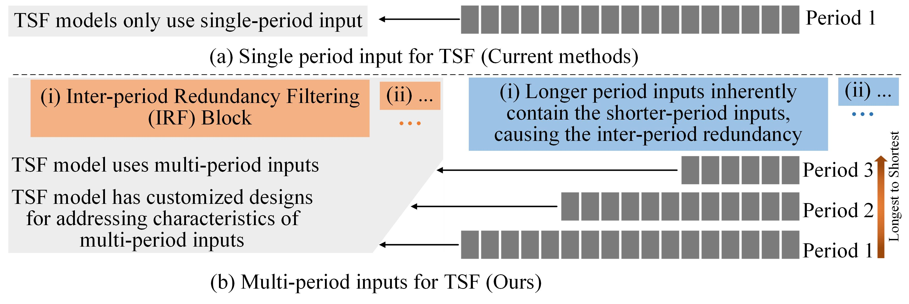
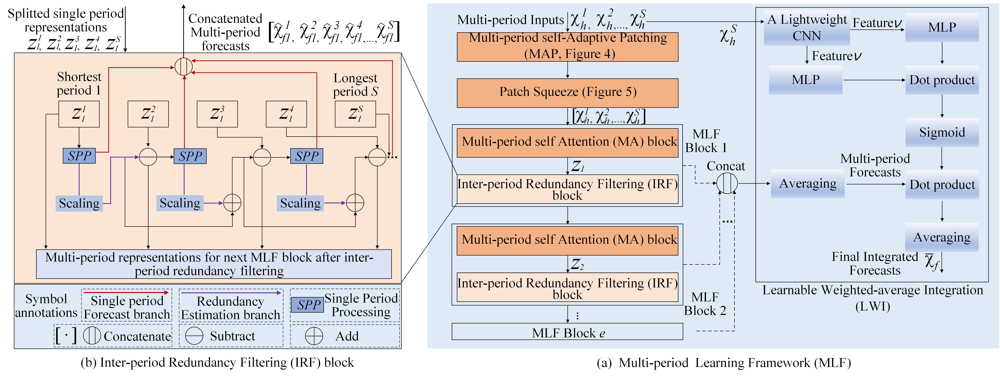
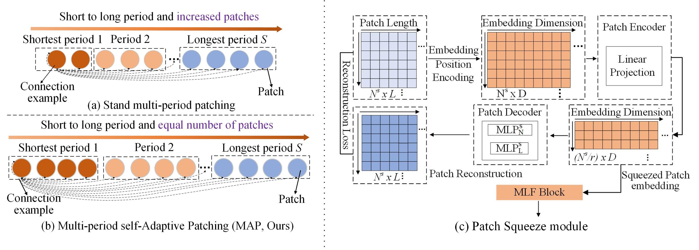
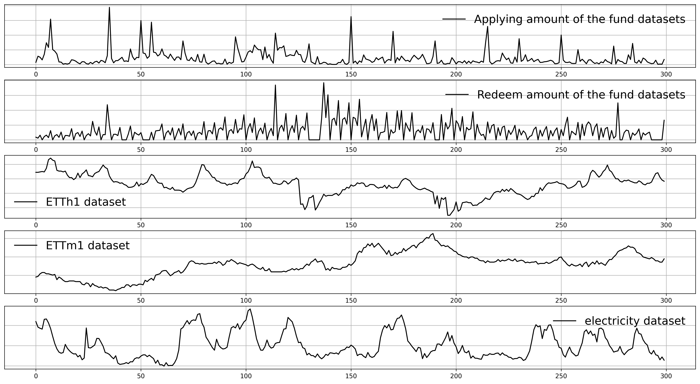

### Multi-period Learning for Financial Time Series Forecasting (MLF, KDD2025)

The paper is available at the link [Paper (PDF)](https://dl.acm.org/doi/pdf/10.1145/3690624.3709422).

### News
- **[2026/06]** We release an **enriched version** of the Fund Sales Dataset with additional covariates (e.g., page exposure UVs and market yield rates) and detailed table schemas. The [original dataset](https://drive.google.com/drive/folders/1KKqHsdd18ZuBdpV8ZiiQxU9bbMkPR4kS) was split by holding period and merged into a unified format; the enriched version extends it with richer features to facilitate more comprehensive research. The enriched dataset in its original unmerged format is available at [Google Drive (Enriched Fund Dataset)](https://drive.google.com/drive/folders/1mx5ItVm2Nyod8n2AixotTSbbFIK5hO35). See [Introduction of Fund Sales Dataset](#introduction-of-fund-sales-dataset) for full table descriptions.

#### Simple introduction

This repo provides official code of Multi-period Learning for Financial Time Series Forecasting (MLF, published in KDD 2025), which incorporates multiple inputs with varying lengths (periods) to achieve better accuracy and reduces the costs of selecting input lengths during training.

In our work, multi-period inputs refer to multiple original time series windows with varying input lengths, as shown in follwoing sub-figure (c). This is different from the multi-scale inputs in Pyraformer and Scaleformer, which are obtained by downsampling from the same fixed input length (follwoing sub-figure (b)).

<p align="center">

</p>

Different input lengths have a significant impact on prediction accuracy. However, selecting appropriate input lengths is a crucial challenge affecting time series forecasting.  we propose MLF to extract the semantic information of short-medium-long-term individually using sequences with varying lengths, to avoid model fails to learn the different semantics under only long-term inputs, e.g., the prediction error of Pathformer and Scaleformer using long-term sequence inputs is higher than that of short-term one. 

It's not easy to use inputs of different lengths simultaneously for prediction due to challenges caused by multi-period characteristics. As shown in the following figure, MLF is a benchmark that exlpores an architecture consists of various componments to address the challenges to incorporate multiple inputs with varying lengths to achieve better accuracy.

<p align="center">

</p>

### Overall architecture
The overall architecture of MLF is shown in following figure.

<p align="center">

</p>

The two simple but effective componments of MLF are shown in following figure. For instance, the Patch Squeeze module significantly improves efficiency
while maintaining good accuracy in the long-term TSF task.

<p align="center">

</p>

### Downloading Datasets
Due to confidentiality reasons, we can only disclose partial data of fund products. You can download the public datasets and **original Fund dataset** from https://drive.google.com/drive/folders/1KKqHsdd18ZuBdpV8ZiiQxU9bbMkPR4kS. The **enriched version** in its original unmerged format is available at can be downloaded from the link https://drive.google.com/drive/folders/1mx5ItVm2Nyod8n2AixotTSbbFIK5hO35. The downloaded folders e.g., "Fund_Dataset",  should be placed at the "dataset" folder. For the **original Fund dataset**, the average holding period of Fund 1, Fund 2, and Fund 3 gradually increases, and the overall time pattern distribution also changes, which can be used for a more comprehensive evaluation of the algorithm's effectiveness. 

### Introduction of Fund Sales Dataset
We collect fund sales datasets of different customers from Ant Fortune, which is an online wealth management platform on the Alipay APP. A subset of fund datasets covering January 2021 to January 2023 is currently released due to confidentiality reasons. The datasets consist of three tables described below.

#### 1. Fund Purchase/Redemption Data and Fund Feature Information Table

|  | Field | Description | Type |
|--|-------|-------------|------|
| 1 | product_pid | Product ID | string |
| 2 | transaction_date | Transaction date | string |
| 3 | apply_amt | Purchase (subscription) amount | double |
| 4 | redeem_amt | Redemption amount | double |
| 5 | net_in_amt | Net purchase amount = purchase amount - redemption amount | double |
| 6 | uv_fundown | UV of fund holdings page | double |
| 7 | uv_stableown | UV of stable holdings page | double |
| 8 | uv_fundopt | UV of fund watchlist page | double |
| 9 | uv_fundmarket | UV of fund market page | double |
| 10 | uv_termmarket | UV of fixed-term market page | double |
| 11 | during_days | Fund holding period (days), i.e., the minimum number of calendar days between redemption and purchase | bigint |
| 12 | total_net_value | Cumulative net asset value | double |


#### 2. Market Information Table

|  | Field | Description | Type |
|--|-------|-------------|------|
| 1 | enddate | Date | string |
| 2 | yield | Yield rate (%) | double |


#### 3. Calendar Information Table

|  | Field | Description | Type |
|--|-------|-------------|------|
| 1 | stat_date | Date | string |
| 2 | is_trade | Whether it is a trading day | bigint |
| 3 | next_trade_date | Next trading day | string |
| 4 | last_trade_date | Previous trading day | string |
| 5 | is_week_end | Whether it is the last trading day of the week | bigint |
| 6 | is_month_end | Whether it is the last trading day of the month | bigint |
| 7 | is_quarter_end | Whether it is the last trading day of the quarter | bigint |
| 8 | is_year_end | Whether it is the last trading day of the year | bigint |
| 9 | trade_day_rank | Global trading day rank | bigint |


Time series visualization of Fund dataset (first two lines) and public datasets is shown as follows:



## Reference

### If you find our dataset and methodology useful in your work, please cite our paper:

```
@inproceedings{zhang2025multi,
  title={Multi-period learning for financial time series forecasting},
  author={Zhang, Xu and Huang, Zhengang and Wu, Yunzhi and Lu, Xun and Qi, Erpeng and Chen, Yunkai and Xue, Zhongya and Wang, Qitong and Wang, Peng and Wang, Wei},
  booktitle={Proceedings of the 31st ACM SIGKDD Conference on Knowledge Discovery and Data Mining V. 1},
  pages={2848--2859},
  year={2025}
}
```
